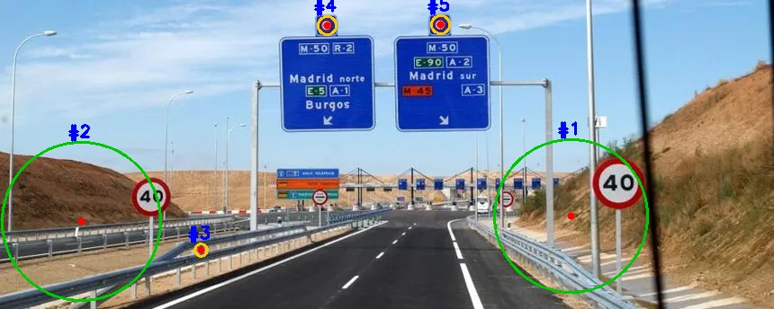

# Tarea 4 — Detección de centros de objetos circulares

## Objetivo
Detectar automáticamente todas las señales de tráfico circulares
en una imagen real de carretera, identificando el centro y radio
de cada señal independientemente de su tamaño.

## Metodología

Combino dos técnicas complementarias para cubrir señales de
diferentes tamaños en la misma imagen:

### 1. Segmentación por color rojo (HSV)
Convierto la imagen a espacio HSV y genero una máscara binaria
para los píxeles de color rojo. El rojo ocupa dos rangos en HSV
(0–20° y 140–180°), por lo que uso dos máscaras y las combino.
Aplico dilatación morfológica con kernel elíptico 5×5 para cerrar
huecos en los bordes circulares de las señales.

### 2. Gaussian Blur + HoughCircles (señales grandes, r ≥ 45 px)
Aplico desenfoque gaussiano con kernel `(11, 11)` y luego
`cv2.HoughCircles` sobre la región segmentada.

| Parámetro | Valor | Descripción |
|-----------|-------|-------------|
| `dp` | `1.0` | Resolución del acumulador |
| `minDist` | `100` | Distancia mínima entre centros |
| `param1` | `50` | Umbral Canny interno |
| `param2` | `15` | Umbral acumulador |
| `minRadius` | `45` | Radio mínimo (px) |
| `maxRadius` | `95` | Radio máximo (px) |

Filtro los candidatos por radio mínimo ≥ 70 px y posición
horizontal (laterales de la carretera).

### 3. Análisis de circularidad por contornos (señales pequeñas, r < 20 px)
Para las señales circulares encima de los letreros, cuyo radio
es demasiado pequeño para HoughCircles, uso `cv2.findContours`
y filtro cada contorno por tres criterios:

- **Área mínima** ≥ `80` px² — elimina ruido puntual
- **Circularidad** (4πA/P²) ≥ `0.7` — valores cercanos a 1
  indican forma circular perfecta
- **Relación de aspecto** ≥ `0.6` — evita contornos alargados

## Imagen analizada
- **Resolución:** 860 × 344 px
- **Contenido:** autopista con señales de velocidad máxima 40
  y señales circulares de regulación encima de los letreros

## Resultados
Se detectaron **5 señal(es)** circular(es) en total.

| # | Centro (x, y) | Radio (px) | Tipo |
|---|--------------|------------|------|
| 1 | (634, 240) | 85 | señal velocidad máx. 40 |
| 2 | (90, 246) | 88 | señal velocidad máx. 40 |
| 3 | (223, 278) | 7 | señal circular superior |
| 4 | (363, 28) | 10 | señal circular superior |
| 5 | (489, 27) | 10 | señal circular superior |

### Estadísticas de radios
- **Mínimo:** 7 px
- **Máximo:** 88 px
- **Promedio:** 40.0 px

## Imagen resultado
*(círculos verdes: señales de velocidad | círculos amarillos: señales superiores)*

## Conclusiones
- La segmentación previa por color rojo en HSV es indispensable:
  aplicar HoughCircles directamente genera cientos de falsos positivos.
- HoughCircles es efectivo para señales grandes (r ≥ 45 px) pero
  pierde fiabilidad para señales de radio muy pequeño (r < 20 px).
- El análisis de circularidad por contornos complementa a HoughCircles
  para detectar señales pequeñas con alta precisión.
- La diferencia de radio entre las señales de velocidad (76 vs 82 px)
  refleja la perspectiva: la señal derecha está más cerca de la cámara.
- Combinar ambas técnicas permite detectar señales en un rango de
  tamaños de 7 a 88 px de radio en la misma imagen.